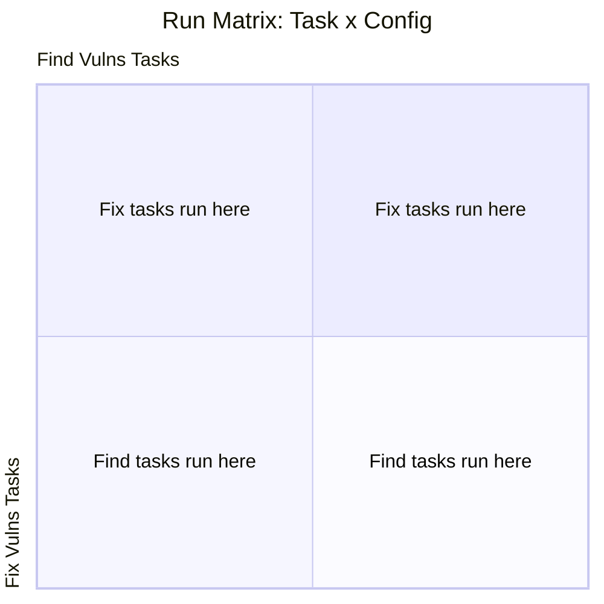
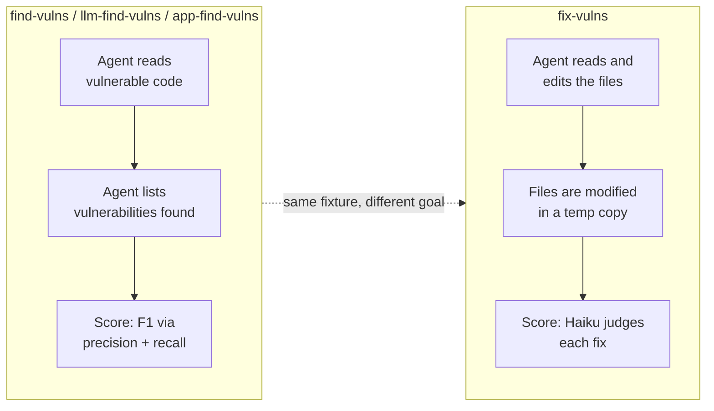
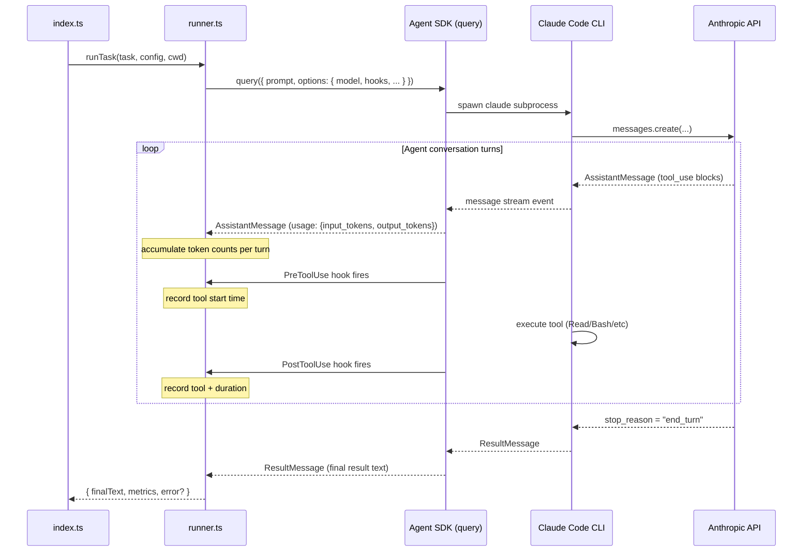
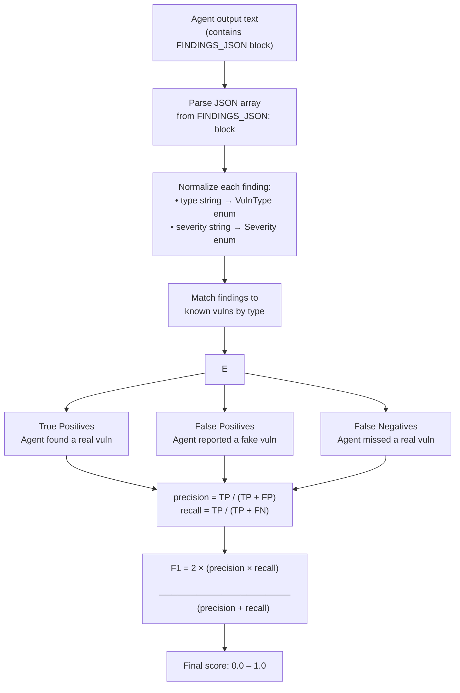
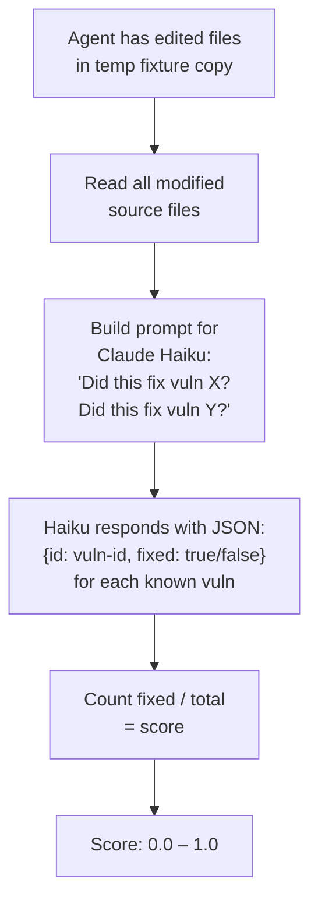

# Benchmark System — How It Works

## Table of Contents

1. [The Core Idea in One Sentence](#the-core-idea-in-one-sentence)
2. [High-Level Overview](#high-level-overview)
   - [The Three Questions This Benchmark Answers](#the-three-questions-this-benchmark-answers)
   - [The Full Pipeline — Flowchart](#the-full-pipeline--flowchart)
   - [How Tasks and Configs Combine](#how-tasks-and-configs-combine)
   - [Eval Categories](#eval-categories)
3. [Detailed Component Reference](#detailed-component-reference)
   - [Fixtures — The Test Cases](#fixtures--the-test-cases)
   - [EvalTask — What to Do](#evaltask--what-to-do)
   - [RunConfig — Who Does It](#runconfig--who-does-it)
   - [Runner — The Agent Session](#runner--the-agent-session)
   - [Metrics — What Was Measured](#metrics--what-was-measured)
   - [Scorer — How Good Was It](#scorer--how-good-was-it)
   - [Reporter — Presenting Results](#reporter--presenting-results)
   - [EvalResult — The Final Record](#evalresult--the-final-record)
4. [Worked Example: A Single Run](#worked-example-a-single-run)
5. [Scoring Deep-Dive](#scoring-deep-dive)
   - [Command configs and Snyk Code (SAST)](#command-configs-and-snyk-code-sast)
   - [When to update `mapRuleId` (Snyk)](#when-to-update-mapruleid-snyk)
6. [Metrics Deep-Dive](#metrics-deep-dive)
   - [Metrics Quick Reference](#metrics-quick-reference)
   - [Session-Level Token Accounting](#session-level-token-accounting)
   - [SDK Message Structure and Deduplication](#sdk-message-structure-and-deduplication)
   - [Cache Tokens](#cache-tokens)
   - [Per-Tool Token Estimates](#per-tool-token-estimates)
   - [Wall Time and Turns](#wall-time-and-turns)
   - [Sample Output — find-vulns Run](#sample-output--find-vulns-run)
   - [Sample Output — fix-vulns Run](#sample-output--fix-vulns-run)
   - [Sample Output — Summary Table](#sample-output--summary-table)
   - [Sample Output — JSONL Record](#sample-output--jsonl-record)
7. [Adding Your Own Tasks and Configs](#adding-your-own-tasks-and-configs)

---

## The Core Idea in One Sentence

We give an AI coding agent a piece of vulnerable code, ask it to find or fix the vulnerabilities, and then measure both **how well it did** (score) and **how expensive it was** (tokens, time, tool calls).

---

## High-Level Overview

### The Three Questions This Benchmark Answers

| Question | Metric |
|---|---|
| **Quality**: Did the agent find/fix the right vulnerabilities? | Score (0–100%) |
| **Cost**: How many tokens did it spend? | Input + output tokens |
| **Efficiency**: How did it spend its time? | Wall time, tool call breakdown |

By running the same tasks against different model configurations, you can compare them across all three dimensions at once.

---

### The Full Pipeline — Flowchart

This is the end-to-end flow for a single run. A "run" is one combination of one task and one configuration.

```mermaid
flowchart TD
    A(["**START** pnpm run benchmark"]) --> B

    subgraph SETUP["① Setup"]
        B["Parse CLI args\n--category, --task, --config"] --> C
        C["Select matching\nEvalTasks"] --> D
        D["Select matching\nRunConfigs"]
    end

    D --> E

    subgraph LOOP["② For each Task × Config pair..."]
        E[/"For every combination\nof task + config"/] --> F
        F{task.type?}
        F -->|fix-vulns| G["Copy fixture to\ntemp directory\n(protect original)"]
        F -->|find-vulns| H["Use fixture\ndirectory directly\n(read-only)"]
        G --> I
        H --> I
    end

    subgraph AGENT["③ Run Agent Session"]
        I["runTask(task, config, cwd)"] --> J
        J["Launch Claude Code via\nAgent SDK query()"] --> K

        subgraph HOOKS["Hooks fire on every tool call"]
            K --> L["PreToolUse hook\nrecord start time"]
            L --> M["Agent uses tools:\nRead, Grep, Glob,\nBash, Write, Edit"]
            M --> N["PostToolUse hook\nrecord duration"]
            N --> O{More tools\nneeded?}
            O -->|yes| L
            O -->|no| P
        end

        P["ResultMessage received\n(agent finished)"] --> Q
        Q["Collect from stream:\n• per-turn token usage\n• tool call records\n• final text output"]
    end

    subgraph SCORE["④ Score the Output"]
        Q --> R{task.type?}
        R -->|find-vulns| S["Parse FINDINGS_JSON\nfrom agent or SAST output"]
        S --> T["Compare found vulns\nagainst vulns.json\nground truth"]
        T --> U["Calculate\nprecision + recall\n→ F1 score"]
        R -->|fix-vulns| V["Read modified\nfiles from temp dir"]
        V --> W["Ask Claude Haiku\nto judge each fix"]
        W --> X["Count fixed/total\n→ ratio score"]
    end

    subgraph RECORD["⑤ Record & Report"]
        U --> Y["Build EvalResult\n(score + metrics + details)"]
        X --> Y
        Y --> Z["Print to console\n(table with score,\ntokens, tool stats)"]
        Z --> AA["Append to JSONL file\nin results/"]
    end

    AA --> AB{More runs?}
    AB -->|yes| E
    AB -->|no| AC["Print summary table\nfor all runs"]
    AC --> AD([END])

    style SETUP fill:#e8f4f8,stroke:#2980b9
    style LOOP fill:#fef9e7,stroke:#f39c12
    style AGENT fill:#e8f8e8,stroke:#27ae60
    style SCORE fill:#fce4ec,stroke:#c0392b
    style RECORD fill:#f3e5f5,stroke:#8e44ad
    style HOOKS fill:#e0f7e0,stroke:#27ae60,stroke-dasharray: 5 5
```



---

### How Tasks and Configs Combine

The benchmark runs every task against every config. This is the **matrix of runs**:



More concretely, with the default setup:

```
                    ┌─────────────────────────────────────────────────────────┐
                    │                    RUN CONFIGS                           │
                    │   opus-4-6               │   sonnet-4-6                 │
  ┌─────────────────┼──────────────────────────┼──────────────────────────────┤
  │  js-find-vulns  │  Run 1: Opus finds JS     │  Run 2: Sonnet finds JS      │
E │                 │  vulns in Express app     │  vulns in Express app        │
V ├─────────────────┼──────────────────────────┼──────────────────────────────┤
A │  js-fix-vulns   │  Run 3: Opus fixes JS     │  Run 4: Sonnet fixes JS      │
L │                 │  vulns in Express app     │  vulns in Express app        │
  ├─────────────────┼──────────────────────────┼──────────────────────────────┤
T │ python-find-    │  Run 5: Opus finds Python │  Run 6: Sonnet finds Python  │
A │ vulns           │  vulns in Flask app       │  vulns in Flask app          │
S └─────────────────┴──────────────────────────┴──────────────────────────────┘
K
S       3 tasks   ×   2 configs   =   6 total runs
```

Each cell in this matrix is one independent `EvalResult`. After all runs complete, you can compare rows (same task, different configs) to understand which model/config performs better.

---

### Eval Categories

An **Eval Category** (`EvalCategory`) is a first-class data structure that determines the agent's goal and the scoring strategy. Each **Eval Task** carries a `category` field pointing to one of the entries in the `EVAL_CATEGORIES` registry — so the category both groups tasks and carries its own metadata.

The `--category` CLI flag filters the task list by category id (e.g. `--category find-vulns` runs only tasks in that category). Adding a new category means adding one entry to `EVAL_CATEGORIES` in `src/types.ts` — `EvalCategoryId` expands automatically.

#### Category Quick Reference

| Category ID | Name | Scoring | Description |
|---|---|---|---|
| `find-vulns` | Find Vulnerabilities | F1 (precision + recall) | General vulnerability finding in code snippets/small apps |
| `llm-find-vulns` | Find LLM Integration Vulnerabilities | F1 (precision + recall) | Vulnerability finding in LLM integration code (prompt injection, unsafe output handling, insecure API integrations) |
| `app-find-vulns` | Find App Vulnerabilities | F1 (precision + recall) | Vulnerability finding in full application codebases (multi-file, larger scope) |
| `fix-vulns` | Fix Vulnerabilities | LLM judge (fraction fixed) | Agent remediates vulnerabilities by editing source files |

#### Category → Task Mapping

```
EVAL_CATEGORIES.FIND_VULNS             EVAL_CATEGORIES.LLM_FIND_VULNS
  { id: "find-vulns" }                   { id: "llm-find-vulns" }
         │                                        │
         ├── js-vulns-1-find-vulns                ├── llm-vulns-1-find-vulns
         ├── js-vulns-2-find-vulns                └── llm-vulns-2-find-vulns
         ├── js-vulns-3-find-vulns
         ├── js-vulns-4-find-vulns         EVAL_CATEGORIES.APP_FIND_VULNS
         ├── js-vulns-5-find-vulns           { id: "app-find-vulns" }
         └── python-find-vulns                    │
                                                  └── app-js-1-find-vulns
EVAL_CATEGORIES.FIX_VULNS
  { id: "fix-vulns" }
         │
         ├── js-vulns-2-fix-vulns
         ├── js-vulns-3-fix-vulns
         ├── js-vulns-4-fix-vulns
         ├── js-vulns-5-fix-vulns
         ├── app-js-1-fix-vulns
         ├── llm-vulns-1-fix-vulns
         └── llm-vulns-2-fix-vulns
```

#### Scoring Pipelines

All three find-* categories (`find-vulns`, `llm-find-vulns`, `app-find-vulns`) share the same scoring pipeline — they differ only in prompt emphasis and task grouping. The `fix-vulns` category uses a separate judge-based pipeline.



#### What Each Category Does

**find-vulns** — The general-purpose vulnerability finding category. The agent reads code and reports what it finds. Used for JS snippet fixtures and other straightforward code audit tasks.

**llm-find-vulns** — Specialized for LLM integration code. The system prompt emphasizes LLM-specific risks (prompt injection, unsafe output handling, insecure API integrations). Used for fixtures that test LLM-aware security reasoning.

**app-find-vulns** — Targets full application codebases (multi-file, larger scope). The system prompt instructs the agent to scan all files across the project. Used for realistic application-level audit tasks.

**fix-vulns** — The agent not only identifies but also edits the source files to remediate vulnerabilities. We work on a copy of the fixture so the originals are never changed. Scored by an LLM judge (Claude Haiku) that evaluates whether each known vulnerability was successfully fixed.

---

## Detailed Component Reference

### Fixtures — The Test Cases

**Location:** `fixtures/`

A fixture is a self-contained directory containing vulnerable source code. It is the "exam question" — the thing we're testing the agent against.

```
fixtures/
  js-vulns.json   ← Ground truth: exactly which vulns exist and where
  js-vulns/
    app.js        ← The vulnerable code (intentionally bad)
  python-vulns.json
  python-vulns/
    app.py
```

The `<fixture-name>.json` file is the **answer key**. It describes every vulnerability that exists in the fixture, along with metadata used for scoring:

```json
{
  "vulnerabilities": [
    {
      "id": "js-sqli-1",          // unique ID used in scoring comparisons
      "type": "sql-injection",    // vulnerability category
      "severity": "critical",     // how dangerous it is
      "file": "app.js",           // which file it's in
      "line": 28,                 // which line
      "description": "User input directly concatenated into SQL query"
    }
  ]
}
```

The `id` field is critical — the scorer uses these IDs to track which vulnerabilities were found vs. missed, and which were fixed vs. still present.

**Why the answer key lives outside the fixture directory:** The agent's `cwd` is set to `fixtures/<name>/` — everything inside that directory is visible to the agent. Keeping the ground-truth JSON as a sibling (`fixtures/<name>.json`) means the agent cannot read the answer key and inadvertently "cheat". Without a fixed, known-good ground truth, you cannot objectively score the agent — and that ground truth must be hidden from the agent for the score to be meaningful.

---

### EvalTask — What to Do

**Location:** `evals/tasks/*.json` — one JSON file per task, loaded at startup by `src/evals/loader.ts`

An `EvalTask` is a complete description of one assignment to give an agent. Think of it as a single exam question.

```typescript
interface EvalTask {
  id: string;            // unique identifier, used in CLI filtering
  name: string;          // human-readable name for output
  category: EvalCategory; // points to EVAL_CATEGORIES.FIND_VULNS or .FIX_VULNS
  fixture: string;       // path to the fixture directory
  systemPrompt?: string; // instructions injected before the task starts
  prompt: string;        // the main instruction sent to the agent
  knownVulns: Vulnerability[]; // loaded automatically from the fixture's vulns.json
  maxTurns?: number;     // max agent conversation turns (prevents runaway)
}
```

Key design decisions baked into the task definition:

- **`systemPrompt`** tells the agent *how* to work. For find-vulns, it instructs the agent to output a structured `FINDINGS_JSON` block at the end — without this, we couldn't reliably parse the agent's findings.
- **`knownVulns`** is loaded automatically from `fixtures/<fixture>.json` by the loader — you never need to duplicate this data.
- **`maxTurns`** is a safety valve. An unconstrained agent could loop forever; this caps it.

---

### RunConfig — Who Does It

**Location:** `evals/run-configs.json` — a JSON array loaded at startup by `src/evals/loader.ts`

A `RunConfig` is a discriminated union — either a **model config** (runs Claude via the Agent SDK) or a **command config** (runs a CLI tool like Snyk directly). Both produce the same `RunOutput` shape and go through the same scorer, so results are directly comparable in the summary table.

```typescript
// Model-based: runs the Agent SDK with a specified Claude model
interface ModelRunConfig {
  type?: "model";      // optional — omitting it defaults to model
  id: string;
  name: string;
  model: string;                           // e.g. "claude-opus-4-6"
  mcpServers?: Record<string, MCPServer>;  // optional: MCP tool servers
  maxTurns?: number;
}

// Command-based: runs a CLI tool (SAST scanner, etc.)
interface CommandRunConfig {
  type: "command";
  id: string;
  name: string;
  command: string;   // template — {fixturePath} is substituted at runtime
  parser: string;    // key into parser registry (src/parsers/index.ts)
}
```

The separation of `EvalTask` and `RunConfig` is the key architectural decision that makes this a *benchmark* rather than a one-off script. It lets you answer: **"Does this task get a better score with a different model, tool setup, or scanning approach?"**

Example comparisons enabled by this design:

| Comparison | What it isolates |
|---|---|
| `opus-4-6` vs `sonnet-4-6` | Raw model quality difference |
| `sonnet-4-6` vs `sonnet-4-6-with-snyk-mcp` | Value of an MCP-connected security tool |
| `sonnet-4-6` vs `snyk-code` | LLM agent vs classic SAST |
| `opus-4-6` vs `snyk-code` | Best model vs best SAST |

**Command configs are find-vulns only.** SAST tools produce findings but don't edit code, so they are automatically skipped (with an error result) if paired with a fix-vulns task.

**Adding a model config with an MCP server:**
```json
{
  "id": "sonnet-with-semgrep",
  "name": "Claude Sonnet 4.6 + semgrep MCP",
  "model": "claude-sonnet-4-6",
  "mcpServers": {
    "semgrep": { "command": "npx", "args": ["@semgrep/mcp"] }
  }
}
```

**Adding a SAST command config:**
```json
{
  "type": "command",
  "id": "snyk-code",
  "name": "Snyk Code SAST",
  "command": "snyk code test {fixturePath} --json",
  "parser": "snyk-code"
}
```

The `parser` key must match a registered parser in `src/parsers/index.ts`. Adding a new SAST tool means adding one parser file and registering it there — no changes to the runner or scorer.

For how Snyk (and any command config) output is turned into findings and matched to `fixtures/<name>.json` ground truth, see [Command configs and Snyk Code (SAST)](#command-configs-and-snyk-code-sast) under **Scoring Deep-Dive**.

---

### Runner — The Agent Session

**Location:** `src/runner.ts`

The runner is the bridge between your benchmark harness and the actual Claude Code agent. It calls `query()` from `@anthropic-ai/claude-agent-sdk` and instruments it to collect metrics.



**What makes this work:**

The Agent SDK fires two hook events around every tool call:

```typescript
hooks: {
  PreToolUse:  [{ matcher: ".*", hooks: [preHook]  }],  // fires BEFORE tool runs
  PostToolUse: [{ matcher: ".*", hooks: [postHook] }],  // fires AFTER tool runs
}
```

We use a `Map<tool_use_id, startTime>` to pair up the pre and post events, giving us the duration of each individual tool call. This is more reliable than trying to parse timing from the message stream.

**Token counting:**

The Agent SDK's message stream includes a `usage` field on every `AssistantMessage`. Each field represents the token count for that one turn. We accumulate them all to get session totals:

```
Turn 1: { input: 1200, output: 300 }
Turn 2: { input: 3400, output: 800 }   ← context grows each turn
Turn 3: { input: 4100, output: 200 }
                               ───────
Total input:  8700   (each turn re-sends the full context)
Total output: 1300   (just the new tokens Claude generated)
```

Note: input tokens grow each turn because the API is stateless — the full conversation history is re-sent every turn. This means a long agent session can be significantly more expensive than its output token count suggests.

**`bypassPermissions` mode:**

The runner uses `permissionMode: "bypassPermissions"` so that file reads and writes in the fixture directory don't pause waiting for user approval. This is essential for automated benchmarking. The `allowDangerouslySkipPermissions: true` flag explicitly acknowledges the risk.

---

### Metrics — What Was Measured

**Location:** `src/types.ts` → `BenchmarkMetrics`, collected by `src/runner.ts`

After a run completes, the runner returns a `BenchmarkMetrics` object containing everything measured during the agent session:

```typescript
interface BenchmarkMetrics {
  sessionDurationMs: number;        // wall-clock ms from first query() call to ResultMessage
  totalInputTokens: number;         // non-cached input tokens, summed across all turns
  totalOutputTokens: number;        // output tokens generated, summed across all turns
  totalCacheReadTokens: number;     // tokens served from prompt cache across all turns
  totalCacheCreationTokens: number; // tokens written into prompt cache across all turns
  totalTurns: number;               // number of assistant messages in the session
  toolCalls: ToolCallRecord[];      // one entry per individual tool execution, in order
  toolStats: {                      // per-tool aggregates
    [toolName: string]: {
      count: number;                // how many times this tool was called
      totalDurationMs: number;      // total wall-clock time spent inside this tool
      totalInputTokensEst: number;  // estimated tokens sent TO the tool (parameters)
      totalOutputTokensEst: number; // estimated tokens returned FROM the tool (result)
    }
  };
}
```

Each entry in `toolCalls`:
```typescript
interface ToolCallRecord {
  tool: string;            // e.g. "Read", "Bash", "Grep"
  durationMs: number;      // wall-clock ms the tool took to execute
  inputTokensEst: number;  // estimated tokens in the tool's input parameters
  outputTokensEst: number; // estimated tokens in the tool's output/result
}
```

**Why `toolStats` matters:**

Different models use tools differently. A model that calls `Bash` 20 times and `Read` 5 times has a very different behavior profile than one that calls `Read` 40 times and `Bash` 0 times. `toolStats` lets you see this. For security tasks especially, you might care whether the model:

- Used `Bash` to run static analysis tools (expensive, potentially powerful)
- Used only `Read` + `Grep` (cheaper, simpler)
- Called `Write`/`Edit` (only relevant for fix-vulns)

See the [Metrics Deep-Dive](#metrics-deep-dive) section for a full explanation of how each field is collected and what the numbers mean.

---

### Scorer — How Good Was It

**Location:** `src/scorer.ts`

The scorer translates the agent's raw output into a number between 0 and 1. The logic is different for each eval category.

#### find-vulns Scoring



**Precision vs Recall:**

- **Precision** answers: "Of all the things the agent reported, what fraction were real vulnerabilities?" A low precision means lots of false alarms.
- **Recall** answers: "Of all the real vulnerabilities, what fraction did the agent find?" A low recall means important vulns were missed.
- **F1** is the harmonic mean — it's 1.0 only when both precision and recall are 1.0. It penalizes both missing vulns and crying wolf.

**Why structured output (`FINDINGS_JSON`)?**

The system prompt asks the agent to output its findings in a specific JSON format at the end:

```
FINDINGS_JSON:
```json
[{ "type": "sql-injection", "file": "app.js", "line": 28, ... }]
```
```

Without this, parsing free-text like "I found a SQL injection vulnerability on line 28 of app.js" is fragile and unreliable. The structured format makes scoring deterministic.

#### fix-vulns Scoring



For fix-vulns, we can't use the same parse-and-compare approach because the agent's output is the modified source files, not text. Instead, we use **Claude Haiku as a judge**: we show it the modified code and ask it to assess each known vulnerability.

We use Haiku (not Opus/Sonnet) for the judge because:
- It's much cheaper — scoring many runs would be costly with a more expensive model
- This is a straightforward yes/no judgment task that doesn't require deep reasoning
- Speed matters less here (scoring happens after the run, not inline)

**Why a temp copy for fix-vulns?**

When the agent fixes vulnerabilities, it actually edits the source files. If it edited the original fixtures, the next run against that fixture would start from already-fixed code, producing misleading results. By copying the fixture to a temp directory first (`index.ts` does this before calling `runTask`), each run always starts from the same baseline.

---

### Reporter — Presenting Results

**Location:** `src/reporter.ts`

The reporter handles all output. It has five functions:

**`printConfigHeader(name, index, total)`** — prints a bold cyan banner line (`━━━ Config: ... [n/m] ━━━`) before each config's group of task results.

**`printRunProgress(taskName, index, total)`** — prints a bold progress line (`▸ [n/N] TaskName`) before each individual run.

**`printResult(result)`** — prints a label-aligned block for one run immediately after it completes. Each metric gets its own line with a fixed-width dim label, making it easy to scan vertically. See [Metrics Deep-Dive](#metrics-deep-dive) for annotated mock output.

**`printSummaryTable(results)`** — prints a compact comparison table after all runs finish. Columns: task id, config id, score (color-coded), recall, precision, total tokens, wall time. Includes per-config score averages. See [Sample Output — Summary Table](#sample-output--summary-table).

**`saveResults(results, dir)`** — writes each result as a JSON line to `results/benchmark-<timestamp>.jsonl`. JSONL (JSON Lines) format means one complete JSON object per line, making it easy to:
- Load into analysis tools (Python pandas, etc.)
- Append new results without re-reading old ones
- Query with `jq` from the command line

See [Sample Output — JSONL Record](#sample-output--jsonl-record) for the full structure of one record.

---

### EvalResult — The Final Record

**Location:** `src/types.ts` → `EvalResult`

Every run produces exactly one `EvalResult`. It is the complete record of everything that happened:

```typescript
interface EvalResult {
  taskId: string;          // e.g. "js-find-vulns"
  taskName: string;        // e.g. "JS App: Find Vulnerabilities"
  runConfigId: string;     // e.g. "opus-4-6"
  runConfigName: string;   // e.g. "Claude Opus 4.6 (no MCP)"
  runConfigType: "model" | "command"; // distinguishes Agent SDK runs from SAST tool runs
  score: number;           // 0.0–1.0
  metrics: BenchmarkMetrics; // tokens, time, tool calls
  details: FindVulnsDetails | FixVulnsDetails; // what happened in scoring
  timestamp: string;       // ISO 8601 — when this run happened
  error?: string;          // set if the run crashed
}
```

`details` is a union type that holds scoring-specific data:

For **find-vulns**:
```typescript
{
  agentFindings: Vulnerability[];   // what the agent actually reported
  truePositives: string[];          // IDs of correctly identified vulns
  falsePositives: number;           // count of spurious reports
  falseNegatives: string[];         // IDs of missed vulns
  precision: number;                // 0–1
  recall: number;                   // 0–1
}
```

For **fix-vulns**:
```typescript
{
  vulnsAttempted: number;  // total known vulns in the fixture
  vulnsFixed: number;      // how many the judge confirmed as fixed
  judgeNotes: string;      // Haiku's explanation for each vuln
}
```

---

## Worked Example: A Single Run

Let's trace exactly what happens when you run:

```bash
pnpm run benchmark -- --task js-find-vulns --config opus-4-6
```

**Step 1 — Setup (`index.ts`)**
- Filters `EVAL_TASKS` to just `js-find-vulns`
- Filters `DEFAULT_RUN_CONFIGS` to just `opus-4-6`
- 1 task × 1 config = 1 run

**Step 2 — Prepare the working directory (`index.ts`)**
- `task.type === "find-vulns"` → no copy needed
- Sets `cwd = fixtures/js-vulns/` (the agent will start here)

**Step 3 — Run the agent (`runner.ts`)**
- Calls `query({ prompt: "Audit all files...", options: { cwd, model: "claude-opus-4-6", hooks: [...] } })`
- The Agent SDK spawns the Claude Code CLI as a subprocess
- The agent starts in `fixtures/js-vulns/` and begins reading `app.js`
- The `PreToolUse` hook fires before each tool call, recording its start time
- The `PostToolUse` hook fires after, recording tool name + duration
- Each `AssistantMessage` from the stream contributes its `usage.input_tokens` and `usage.output_tokens` to running totals
- When the agent finishes, we receive a `ResultMessage` with the final text

**Step 4 — The agent's output (example)**
```
I've analyzed app.js and found the following security vulnerabilities:

The application contains several critical security issues...
[analysis text]

FINDINGS_JSON:
```json
[
  { "type": "sql-injection", "file": "app.js", "line": 28, "severity": "critical", "description": "..." },
  { "type": "xss", "file": "app.js", "line": 42, "severity": "high", "description": "..." },
  { "type": "path-traversal", "file": "app.js", "line": 56, "severity": "high", "description": "..." },
  { "type": "hardcoded-credentials", "file": "app.js", "line": 8, "severity": "high", "description": "..." }
]
```
```

**Step 5 — Score (`scorer.ts`)**
- Parses the JSON block: 4 findings
- Known vulns: 5 (`js-sqli-1`, `js-xss-1`, `js-path-traversal-1`, `js-cmd-injection-1`, `js-hardcoded-creds-1`)
- Matching:
  - `sql-injection` → matches `js-sqli-1` ✓
  - `xss` → matches `js-xss-1` ✓
  - `path-traversal` → matches `js-path-traversal-1` ✓
  - `hardcoded-credentials` → matches `js-hardcoded-creds-1` ✓
  - `js-cmd-injection-1` → NOT found ✗
- TP=4, FP=0, FN=1
- Precision = 4/4 = 1.0, Recall = 4/5 = 0.8
- F1 = 2×(1.0×0.8)/(1.0+0.8) = **0.889**

**Step 6 — Report (`reporter.ts`)**
- `printResult()` writes the detailed block to console
- `saveResults()` appends the full `EvalResult` JSON to `results/benchmark-<timestamp>.jsonl`

---

## Scoring Deep-Dive

### Why F1 and Not Just Recall?

You might think "recall is what matters — finding all the vulns is the goal." That's partially true, but a system that reports *every possible string combination as a vulnerability* would have 100% recall and be useless. F1 penalizes that by also requiring precision.

```
Scenario A: Agent finds 5/5 known vulns but also reports 20 fake ones
  Precision = 5/25 = 0.20    Recall = 5/5 = 1.00    F1 = 0.33

Scenario B: Agent finds 4/5 known vulns with no false alarms
  Precision = 4/4 = 1.00    Recall = 4/5 = 0.80    F1 = 0.89

Scenario B is the better result — and F1 correctly ranks it higher.
```

### How Vuln Type Matching Works

The scorer (`scoreFindVulns` in `src/scorer.ts`) matches **parsed findings** (from an LLM or from a SAST command config — see below) to known vulnerabilities by their **normalized type**, not by file, line, Snyk rule id, or description. This is intentional:

- An agent might say "line 29" instead of "line 28" — exact line matching would unfairly penalize this
- An agent might phrase it as "SQL injection" or "SQLi" or "SQL Injection" — `normalizeVulnType` maps these to the same `VulnType` string (e.g. `"sql-injection"`) before comparing
- Each known vuln can only be matched once (no double-counting)

**Algorithm (greedy, type-only):** `knownVulns` comes from the task in **array order** (as loaded from `fixtures/<fixture-name>.json`). The scorer walks **findings in the order they appear** in the JSON array. For each finding, it picks the **first** ground-truth row that is not yet matched and whose `type` equals the finding’s type (`vulnTypesMatch` — strict equality on `VulnType` after normalization). `file` and `line` on findings are stored in `details.agentFindings` for inspection and JSONL output but **play no role** in true positive / false positive / false negative counts. (A code comment in `scorer.ts` mentions “within same file”; the implementation does **not** filter by file.)

If you add a fixture with two different SQL injections in the same file, give them different IDs (`sqli-1`, `sqli-2`) so they appear as two ground-truth rows. The scorer will match **at most two** `sql-injection` findings to them, in **pairing order**: the *i*-th reported `sql-injection` finding in the parsed array pairs with the *i*-th still-unmatched `sql-injection` in `knownVulns` order — not by comparing line numbers to the JSON `line` fields.

### Command configs and Snyk Code (SAST)

Command-based run configs (e.g. `snyk-code` in `evals/run-configs.json`) run an external CLI against the fixture directory, parse **stdout** into the same finding shape as the LLM path, then reuse **identical** find-vulns scoring. This section is the reference for “how do Snyk’s results line up with `fixtures/js-vulns-1.json` (or any ground-truth file)?”

#### 1. Where the run is dispatched

**`src/index.ts`** — If `config.type === "command"`, the harness calls `runCommandTask` from `src/command-runner.ts` instead of `runTask` from `src/runner.ts`. The fixture path passed in is the task’s `fixture` directory (same as for find-vulns agents). Command configs are skipped with an error when paired with fix-vulns tasks (see [RunConfig](#runconfig--who-does-it)).

#### 2. Command execution and stdout

**`src/command-runner.ts`**

- Substitutes the token `{fixturePath}` in the config’s `command` string with the actual fixture directory path (split on spaces; paths with spaces are handled because substitution replaces a whole token).
- Runs `execFile(program, args, …)` with a large `maxBuffer` so big SARIF payloads fit.
- **`snyk code test` exits non-zero when issues are found** — that is expected. On failure, if `err.stdout` is present, the runner treats it as success and uses that stdout (the JSON/SARIF body). If there is no stdout, it returns an `error` result.

#### 3. Parser: SARIF → `FindingRecord[]`

**`src/parsers/index.ts`** registers parsers by string key (`"snyk-code"` → `parseSnykCodeOutput`). A **`FindingRecord`** has `type`, `file`, `line`, `severity`, and `description` — the same fields the scorer expects inside `FINDINGS_JSON`.

**`src/parsers/snyk-code.ts`** — `parseSnykCodeOutput(stdout)`:

- Parses stdout as JSON and reads SARIF-ish structure: `runs[0].results[]` (as emitted by `snyk code test --json`).
- **`ruleId` is the sourced field:** Each item is a SARIF **`result`** object. Vulnerability-kind mapping uses the standard SARIF string property **`ruleId`** — `runs[0].results[i].ruleId` — passed to `mapRuleId()` (see the `parseSnykCodeOutput` docblock). For spot-checks on captured stdout: JSONPath **`$.runs[0].results[*].ruleId`**, or **`$.runs[*].results[*].ruleId`** when multiple runs exist; JSON Pointer to the first finding’s rule id: **`/runs/0/results/0/ruleId`**.
- For each result that includes **`ruleId`**, builds one finding:
  - **`type`:** from `mapRuleId(ruleId)` — regex heuristics on the lowercase `ruleId` string (e.g. `javascript/SqlInjection` → `"sql-injection"`, `javascript/PrototypePollution` → `"prototype-pollution"`, `javascript/TooPermissiveCorsHeader` → `"origin-validation-error"`). The SARIF log also includes per-rule **`shortDescription.text`** in `runs[0].tool.driver.rules` for human-readable labels (e.g. “Origin Validation Error”). Anything that does not match maps to **`"other"`**.
  - **`file`:** `locations[0].physicalLocation.artifactLocation.uri` (may be a relative path or a `file://` URI depending on Snyk output).
  - **`line`:** `locations[0].physicalLocation.region.startLine` if present.
  - **`severity`:** `mapLevel` maps SARIF `level` (`error` → `"high"`, `warning` → `"medium"`, `note` → `"low"`).
  - **`description`:** `message.text`.

Alignment with a ground-truth row such as those in **`fixtures/js-vulns-1.json`** is therefore **primarily a contract on `type`**: the Snyk `ruleId` must map (via `mapRuleId`) to the same `VulnType` string as the `"type"` field in the fixture JSON. If Snyk uses a rule id that falls through to `"other"` while the benchmark expects a specific type, that finding will not match any known vuln (unless the ground truth literally uses `"other"`), and recall will suffer until the mapping is extended.

#### 4. Bridging to the scorer: synthetic `FINDINGS_JSON`

Still in **`src/command-runner.ts`**: after `parser(stdout)` returns `FindingRecord[]`, the runner sets `finalText` to the `FINDINGS_JSON:` marker, a newline, a Markdown `json` fenced block, and `JSON.stringify(findings, null, 2)` inside it — the same outer shape as the LLM contract described under [find-vulns Scoring](#find-vulns-scoring) (**Why structured output (`FINDINGS_JSON`)?**). No separate code path in the scorer is required.

So `scoreFindVulns` in **`src/scorer.ts`** runs unchanged: `parseFindings` extracts the JSON array, `normalizeFindings` assigns synthetic ids `found-0`, `found-1`, … and normalizes types/severities.

**`metrics.filesScanned`** for command runs is derived from the **unique `file` strings** in the parsed findings (not from the Agent SDK), as noted in `command-runner.ts`.

#### 5. Matching to ground truth (same as LLM)

Scoring uses **`scoreFindVulns(finalText, task)`** — the same type-only greedy matching described in [How Vuln Type Matching Works](#how-vuln-type-matching-works). There is **no** secondary matcher that lines up Snyk SARIF rule ids or line numbers to `fixtures/<name>.json` **`id`** fields. A Snyk result “counts” toward `js-xss-1` only if:

1. `mapRuleId` produced `"xss"`, and  
2. That finding is paired by the greedy walk with that ground-truth row (i.e. it is the first unmatched `"xss"` in `knownVulns` order when this finding is processed, given earlier findings already consumed other `"xss"` slots).

So two XSSes in the fixture are distinguished only by **order of unmatched `xss` rows in the JSON** vs **order of `xss` findings in Snyk’s results array** — not by verifying that Snyk’s line matches the `"line"` in the answer key.

#### 6. Implications for benchmark authors

- Keep **`type`** in `fixtures/<name>.json` consistent with `mapRuleId` in `src/parsers/snyk-code.ts` when you care about Snyk parity for that rule family.
- When multiple known vulns share a type, **ordering** in the ground-truth file and **ordering** of Snyk results affect which ID is credited; consider ordering `vulnerabilities[]` to match typical Snyk emission order if you want stable pairing, or plan for a future location-aware matcher if you need strict line-to-id alignment.
- **`found === "other"`** does not match arbitrary known types (`vulnTypesMatch` returns false for `"other"` findings except when the known type is also `"other"`).

#### When to update `mapRuleId` (Snyk)

The SARIF → **`VulnType`** step is **`mapRuleId()`** in **`src/parsers/snyk-code.ts`**. You should extend it when:

- You add or change **fixtures** and Snyk reports findings whose **`ruleId`** is not yet recognised (often showing up as parsed `"type": "other"` in JSONL `details.agentFindings`).
- You **upgrade Snyk** or see **new / renamed `ruleId`s** in real SARIF (including abbreviated ids such as `javascript/OR`, `javascript/PT`, `javascript/Sqli`).
- You add a **command config** that still uses the **`snyk-code`** parser — the same `mapRuleId` applies; wire the config in `evals/run-configs.json` only after the parser can map the rules you care about.

Operational checklist, example `jq` invocations, and the distinction between “**new `VulnType`**” vs “**existing type, new Snyk id**” live in **`docs/benchmark-management.md`** → [Maintaining Snyk Code ruleId mappings](./benchmark-management.md#maintaining-snyk-code-ruleid-mappings).

---

## Metrics Deep-Dive

This section explains every metric the benchmark collects, how each one is captured, and what the numbers mean when you read a report.

---

### Metrics Quick Reference

Every metric the benchmark produces, at a glance. The "Report line" column shows where it appears in the console output; "JSONL field" shows the key path in the saved result file.

#### Quality metrics (find-vulns)

| Metric | Report line | JSONL field | What it means |
|---|---|---|---|
| **Score (F1)** | `Score (F1) :  X%` | `score` | Harmonic mean of precision and recall — the headline quality number |
| **Recall** | `Recall      :  X%  (N/M known vulns found)` | `details.recall` | Fraction of real vulns the agent found |
| **Precision** | `Precision   :  X%  (N false positives)` | `details.precision` | Fraction of agent's findings that were real |
| **True positives** | Implicit in recall line | `details.truePositives` | IDs of real vulns correctly identified |
| **False positives** | `(N false positives)` | `details.falsePositives` | Count of agent findings with no matching ground-truth vuln |
| **False negatives** | `Missed      :  id1, id2` | `details.falseNegatives` | IDs of real vulns the agent did not find |

#### Quality metrics (fix-vulns)

| Metric | Report line | JSONL field | What it means |
|---|---|---|---|
| **Score** | `Score       :  X%` | `score` | Fraction of known vulns confirmed fixed by the LLM judge |
| **Vulns fixed** | `Fixed       :  N/M vulnerabilities` | `details.vulnsFixed` | Count confirmed remediated |
| **Vulns attempted** | `Fixed       :  N/M vulnerabilities` | `details.vulnsAttempted` | Total known vulns in the fixture |
| **Judge notes** | `Notes       :  ...` | `details.judgeNotes` | Per-vuln verdict from the LLM judge (Claude Haiku) |

#### Session metrics (all eval types)

| Metric | Report line | JSONL field | What it means |
|---|---|---|---|
| **Wall time** | `Time        :  Xs` | `metrics.sessionDurationMs` | Clock time from query start to finish, including all API round-trips and tool execution |
| **Turns** | `Turns       :  N` | `metrics.totalTurns` | Unique API calls made (after dedup — see [SDK Message Structure](#sdk-message-structure-and-deduplication)) |
| **Files scanned** | `Files       :  N` | `metrics.filesScanned` | Distinct file paths touched by Read/Write/Edit; proxy for codebase exploration depth |
| **Input tokens** | `in: N` (inside Tokens line) | `metrics.totalInputTokens` | New non-cached input tokens across all turns |
| **Output tokens** | `out: N` (inside Tokens line) | `metrics.totalOutputTokens` | All tokens Claude generated across all turns |
| **Cache-read tokens** | `cache-read: N` (inside Tokens line) | `metrics.totalCacheReadTokens` | Context served from prompt cache (~10% billing rate) |
| **Cache-write tokens** | `cache-write: N` (inside Tokens line) | `metrics.totalCacheCreationTokens` | Context written into prompt cache (~125% billing rate) |
| **Total tokens** | `Tokens      :  N` | sum of the four above | Total context consumed — not a direct cost proxy (see [Cache Tokens](#cache-tokens)) |
| **Per-tool stats** | `Tools       :  Read 4x avg 11ms ...` | `metrics.toolStats` | Per-tool call count, avg duration, and estimated input/output tokens |

---

### Session-Level Token Accounting

The Anthropic API reports token usage on every API call. The runner accumulates these across the full session:

```
Turn 1 (system prompt + user message):
  input_tokens: 1,840   output_tokens: 420

Turn 2 (context + tool results from turn 1):
  input_tokens:   210   output_tokens: 180   cache_read_input_tokens: 1,840

Turn 3 (context + tool results from turns 1–2):
  input_tokens:   180   output_tokens: 920   cache_read_input_tokens: 2,260
  ...

Session totals (summed across all turns):
  totalInputTokens:       2,230   ← new non-cached tokens across all turns
  totalOutputTokens:      1,520   ← all tokens Claude generated
  totalCacheReadTokens:   9,460   ← context tokens served from cache
  totalCacheCreationTokens: 1,840 ← tokens written into cache on turn 1
```

**Important:** the four token fields represent *different things* and must all be counted to understand true session cost:

| Field | What it counts | Billing rate |
|---|---|---|
| `totalInputTokens` | New non-cached input tokens per turn | Full input rate |
| `totalOutputTokens` | All tokens Claude generated | Output rate |
| `totalCacheReadTokens` | Context tokens served from the prompt cache | ~10% of input rate |
| `totalCacheCreationTokens` | Tokens written into the cache for the first time | ~125% of input rate |

The `Tokens: N total` line in the report sums all four to give you the full picture of context consumed.

**Why not just read usage from the final ResultMessage?** The ResultMessage's `usage` field contains only the cost of that final "done" turn — a few tokens — not a session cumulative total. Using it would silently overwrite all the accumulated per-turn data with a misleadingly small number. The runner explicitly accumulates only from `AssistantMessage` turns.

---

### SDK Message Structure and Deduplication

This is a critical implementation detail. **The Agent SDK emits one `SDKAssistantMessage` event per content block in an API response — not one per API call.** A single Claude API response containing both a thinking block and a tool_use block fires two separate events, each carrying the *same* `usage` object:

```
API call returns:  content=[thinking, tool_use]  usage={in:3, out:54, cr:9845}

SDK emits:
  SDKAssistantMessage #1  content=[thinking]  usage={in:3, out:54, cr:9845}
  SDKAssistantMessage #2  content=[tool_use]  usage={in:3, out:54, cr:9845}
```

If you naively accumulate `usage.output_tokens` on every event, those 54 tokens get counted twice. The Anthropic API billed you once; you'd record it twice.

**The fix — deduplication by session and usage fingerprint:**

The runner tracks the last-seen usage fingerprint keyed by `parent_tool_use_id` (which session level the message belongs to). It only accumulates when the fingerprint changes:

```typescript
const sessionKey = message.parent_tool_use_id ?? null;
const usageKey = `${in}:${out}:${cr}:${cw}`;
if (lastUsagePerSession.get(sessionKey) !== usageKey) {
  lastUsagePerSession.set(sessionKey, usageKey);
  // accumulate tokens and increment turn counter
}
```

This guarantees each unique API call is counted exactly once regardless of how many content blocks it produced.

**Sub-agent sessions:** The Claude Code `Agent` built-in tool spawns a nested sub-agent session. That sub-session's messages stream through the same `query()` iterator with `parent_tool_use_id` set to the parent's tool call ID. Sub-agent usage IS counted in the session totals — these are real API calls with real cost — and deduplication handles them correctly because they are tracked under their own `parent_tool_use_id` key, separate from the root session.

**What `totalTurns` counts:** unique API calls, after deduplication. Not content blocks, not SDK events. A turn where Claude responds with `[thinking, tool_use, tool_use]` counts as one turn.

---

### Cache Tokens

**Short answer: yes, cache tokens count — they represent real cost, just at heavily discounted rates.**

Prompt caching is an automatic Anthropic API feature. When the same prefix (system prompt + early conversation context) appears in multiple consecutive API calls, the API stores that prefix on Anthropic's servers after the first call. Subsequent calls that reuse the same prefix pay a fraction of the normal input rate instead of re-processing it from scratch. No benchmark code configuration is needed — the Claude Code subprocess triggers it automatically.

There are two sides to the cache economy:

| Token type | When it appears | Billing rate |
|---|---|---|
| `totalCacheCreationTokens` | First call that establishes the cached prefix | ~125% of input rate |
| `totalCacheReadTokens` | Every subsequent call that reads from the cache | ~10% of input rate |

In a typical multi-turn benchmark session the system prompt (~500 tokens) plus the fixture code (~300 tokens) get cached after turn 1. Turns 2 onward each read ~800 tokens from cache instead of paying full input rate. This means `totalCacheReadTokens` can easily be 5–10× larger than `totalInputTokens` in a long session — the bulk of context consumed is cheap cache reads.

The "Tokens" line in the report shows the total and a breakdown:
```
    Tokens     :  18,432  (in: 4,210  out: 1,820  cache-read: 11,900  cache-write: 502)
```

If no caching occurred (e.g. a very short single-turn session), the cache fields are omitted:
```
    Tokens     :  6,030  (in: 4,210  out: 1,820)
```

When tokens are 0 (SAST/command runs), the line simply shows `0`:
```
    Tokens     :  0
```

**Important for benchmarking:** The `N total` figure is *context consumed*, not *cost*. Because cache-read tokens bill at ~10% of the input rate, two runs that did the same logical work but had different cache hit rates will show very different totals. To compare actual cost across runs, weight each field by its billing rate rather than summing raw counts. For within-session comparisons (same model, same fixture, different configs), total tokens is a reasonable proxy because cache behavior is roughly symmetric.

Prompt caching activates automatically when the cacheable prefix is at least 1,024 tokens. Below that threshold `totalCacheReadTokens` and `totalCacheCreationTokens` will both be 0 even in multi-turn sessions.

---

### Per-Tool Token Estimates

The Anthropic API reports tokens at the *turn* level, not per individual tool call within a turn. To give per-tool token insight, the runner estimates token counts from content size in the `PostToolUse` hook:

```
inputTokensEst  = ceil(JSON.stringify(tool_input).length  / 4)
outputTokensEst = ceil(JSON.stringify(tool_result).length / 4)
```

The `/ 4` approximation is the standard rule-of-thumb for English text (one token ≈ 4 characters). These are labelled `(est)` in the report to indicate they are estimates, not exact API-measured values.

**What the estimates tell you:** Even as approximations, per-tool token estimates reveal which tools dominate context growth. A single `Read` call on a 500-line file returns ~2,500 estimated output tokens — that content lands in the next turn's input. Multiple such reads compound quickly and explain why `totalCacheReadTokens` grows as the session progresses.

`toolStats` aggregates these across all calls to the same tool:
```typescript
toolStats["Read"] = {
  count: 4,
  totalDurationMs: 44,
  totalInputTokensEst: 320,    // total tokens in Read parameters (filename strings)
  totalOutputTokensEst: 8240,  // total tokens in file contents returned
}
```

---

### Wall Time and Turns

- **`sessionDurationMs`** — measured from just before `query()` is called to when the async iterator returns. It includes all API round-trips, tool execution time, and any local processing. It is wall-clock time, not CPU time.

- **`totalTurns`** — the count of unique API calls made across the session, after deduplication (see [SDK Message Structure and Deduplication](#sdk-message-structure-and-deduplication)). This includes both the root session and any sub-agent sessions spawned via the `Agent` tool. A high turn count with low output tokens per turn suggests the agent is doing many small tool calls; a low turn count with high output tokens suggests longer reasoning blocks. Note: because sub-agent turns are included, `totalTurns` can exceed what you'd count from the console output alone.

- **Per-tool `durationMs`** — measured from the `PreToolUse` hook firing to the `PostToolUse` hook firing. For `Read`/`Grep`/`Glob` this is filesystem I/O time. For `Bash` it includes subprocess spin-up and command execution. For `Write`/`Edit` it is the disk write time.

---

### Sample Output — find-vulns Run

Runs are grouped by config with a banner header. Each run shows a progress counter and a label-aligned metric block. Annotations in `← ...` are for this doc only and do not appear in real output.

```
━━━ Config: Claude Opus 4.6 (no MCP) [1/2] ━━━━━━━━━━━━━━━━━━━━━━━━  ← bold cyan banner

  ▸ [1/4] JS App: Find Vulnerabilities                                ← bold task name + progress
    Score (F1) :  89%                                                  ← color-coded (green/yellow/red)
    Recall     :  100%  (5/5 known vulns found)                        ← fraction of ground-truth vulns
    Precision  :  83%  (1 false positives)                             ← fraction of findings that were real
    Missed     :  none                                                 ← IDs of missed vulns (green if none)
    Time       :  24.8s
    Turns      :  6
    Files      :  4
    Tokens     :  18,432  (in: 4,210  out: 1,820  cache-read: 11,900  cache-write: 502)
    Tools      :  Read 4x avg 11ms ~320 in / ~8,240 out · Bash 3x avg 53ms ~45 in / ~180 out
```

**Reading the token line:**
- `in: 4,210` — new context tokens paid at full rate across all 6 turns
- `out: 1,820` — tokens Claude generated (reasoning + tool calls + final answer)
- `cache-read: 11,900` — repeated context (system prompt, fixture code) served from cache
- `cache-write: 502` — context written into cache on the first turn
- `18,432` — everything added together

**Reading the tools line:**
- `Read 4x` — called 4 times
- `avg 11ms` — average wall-clock time per call
- `~320 in / ~8,240 out` — estimated tokens in parameters and results (this lands in context next turn)

---

### Sample Output — fix-vulns Run

```
  ▸ [3/4] JS App: Fix Vulnerabilities
    Score      :  80%
    Fixed      :  4/5 vulnerabilities
    Notes      :  Fixed SQL injection (parameterized queries), XSS (output escaping), path traversal
                  (realpath validation), and hardcoded credentials (env vars). Command injection fix
                  was incomplete — exec() replaced with spawn() but args still concatenated.
    Time       :  48.2s
    Turns      :  12
    Files      :  4
    Tokens     :  42,100  (in: 8,400  out: 3,600  cache-read: 28,900  cache-write: 1,200)
    Tools      :  Read 6x avg 9ms · Edit 5x avg 22ms · Bash 2x avg 41ms · Glob 1x avg 6ms
```

Note the difference in tool usage: `Edit` calls dominate for fix tasks (high input tokens from before/after diff content, near-zero output), while `Read` dominates for find tasks.

---

### Sample Output — Summary Table

After all runs complete, `printSummaryTable()` prints a comparison across the full task × config matrix. For find-vulns tasks, Recall and Precision columns are included. Scores are color-coded (green >= 90%, yellow 70-89%, red < 70%). Per-config averages are shown at the bottom.

```
══════════════════════════════════════════════════════════════════════
  BENCHMARK SUMMARY
══════════════════════════════════════════════════════════════════════

  Task                     Config       Score   Recall   Prec.    Tokens    Time
  ───────────────────────  ──────────   ─────   ──────   ─────   ───────   ─────
  js-vulns-1-find-vulns    sonnet-4-6     77%     83%     71%    54,385   37.8s
  js-vulns-2-find-vulns    sonnet-4-6     86%    100%     75%    54,420   31.2s
  js-vulns-1-find-vulns    snyk-code      92%    100%     86%         0   11.8s
  js-vulns-2-find-vulns    snyk-code     100%    100%    100%         0   10.4s

  Avg by config:  sonnet-4-6  82%   |   snyk-code  96%
```

Reading across a row (same task, different configs) tells you which model/tool combination performs better and at what cost. Reading down a column (same config, different tasks) tells you how a given model handles different languages and vulnerability types.

---

### Sample Output — JSONL Record

Each run appends one JSON object to `results/benchmark-<timestamp>.jsonl`. This is the complete record — everything the console shows plus the raw data behind it:

```json
{
  "taskId": "js-find-vulns",
  "taskName": "JS App: Find Vulnerabilities",
  "runConfigId": "opus-4-6",
  "runConfigName": "Claude Opus 4.6 (no MCP)",
  "runConfigType": "model",
  "score": 0.888,
  "timestamp": "2026-03-26T21:49:22.964Z",
  "metrics": {
    "sessionDurationMs": 24800,
    "totalInputTokens": 4210,
    "totalOutputTokens": 1820,
    "totalCacheReadTokens": 11900,
    "totalCacheCreationTokens": 502,
    "totalTurns": 6,
    "toolCalls": [
      { "tool": "Read", "durationMs": 12, "inputTokensEst": 8, "outputTokensEst": 2100 },
      { "tool": "Bash", "durationMs": 61, "inputTokensEst": 18, "outputTokensEst": 42 },
      { "tool": "Read", "durationMs": 9,  "inputTokensEst": 8, "outputTokensEst": 2180 }
    ],
    "toolStats": {
      "Read": { "count": 4, "totalDurationMs": 44, "totalInputTokensEst": 320, "totalOutputTokensEst": 8240 },
      "Bash": { "count": 3, "totalDurationMs": 159, "totalInputTokensEst": 45, "totalOutputTokensEst": 180 },
      "Grep": { "count": 2, "totalDurationMs": 16, "totalInputTokensEst": 28, "totalOutputTokensEst": 640 }
    }
  },
  "details": {
    "agentFindings": [
      { "type": "sql-injection", "file": "app.js", "line": 24, "severity": "critical", "description": "..." },
      { "type": "xss", "file": "app.js", "line": 31, "severity": "high", "description": "..." }
    ],
    "truePositives": ["js-sqli-1", "js-xss-1", "js-path-traversal-1", "js-hardcoded-creds-1", "js-cmd-injection-1"],
    "falsePositives": 1,
    "falseNegatives": [],
    "precision": 0.833,
    "recall": 1.0
  }
}
```

The JSONL file can be queried directly:
```bash
# Show all scores
jq '.score' results/benchmark-*.jsonl

# Compare model vs SAST scores for the same task
jq 'select(.taskId == "js-find-vulns") | {config: .runConfigId, type: .runConfigType, score: .score}' results/benchmark-*.jsonl

# Only model runs (exclude SAST tools)
jq 'select(.runConfigType == "model")' results/benchmark-*.jsonl

# Only SAST tool runs
jq 'select(.runConfigType == "command")' results/benchmark-*.jsonl

# Compare token costs across model configs for the same task
jq 'select(.taskId == "js-find-vulns" and .runConfigType == "model") | {config: .runConfigId, tokens: (.metrics.totalInputTokens + .metrics.totalOutputTokens + .metrics.totalCacheReadTokens + .metrics.totalCacheCreationTokens)}' results/benchmark-*.jsonl

# Find the most-used tool across all model runs
jq 'select(.runConfigType == "model") | .metrics.toolStats | to_entries | max_by(.value.count) | .key' results/benchmark-*.jsonl
```

---

## Adding Your Own Tasks and Configs

No source code changes required — the benchmark uses a directory-scanning loader. See [`docs/benchmark-management.md`](./benchmark-management.md) for the full guide, including field references, worked examples, and troubleshooting.

**Quick summary:**

- **New fixture:** create `fixtures/<name>/` with your vulnerable code, and a sibling `fixtures/<name>.json` as the answer key
- **New eval task:** drop a JSON file in `evals/tasks/<id>.json` with `id`, `name`, `category`, `fixture` fields
- **New model config:** append a `ModelRunConfig` entry to `evals/run-configs.json` (or omit `"type"` — it defaults to model)
- **New SAST config:** append a `CommandRunConfig` entry with `"type": "command"`, `"command"`, and `"parser"` fields
- **New SAST parser:** add a file to `src/parsers/` and register it in `src/parsers/index.ts`
- **Snyk `ruleId` → benchmark `type`:** when fixtures, Snyk versions, or comparisons suggest missing mappings, update **`mapRuleId()`** in **`src/parsers/snyk-code.ts`** (see [When to update `mapRuleId` (Snyk)](#when-to-update-mapruleid-snyk) and [`docs/benchmark-management.md`](./benchmark-management.md#maintaining-snyk-code-ruleid-mappings))

### Running a Specific Combination

```bash
# All tasks, all configs (the full matrix)
pnpm run benchmark

# Filter by category — run every task in that category across all configs
pnpm run benchmark -- --category find-vulns
pnpm run benchmark -- --category llm-find-vulns
pnpm run benchmark -- --category app-find-vulns
pnpm run benchmark -- --category fix-vulns

# Shorthand scripts for common categories
pnpm run benchmark:find    # equivalent to --category find-vulns
pnpm run benchmark:fix     # equivalent to --category fix-vulns

# Filter by a specific task (one row of the matrix), across all configs
pnpm run benchmark -- --task js-vulns-1-find-vulns

# Select multiple tasks by comma-separating them (no spaces)
pnpm run benchmark -- --task js-vulns-1-find-vulns,js-vulns-2-find-vulns

# Filter by a specific config (one column of the matrix), across all tasks
pnpm run benchmark -- --config opus-4-6

# Select multiple configs by comma-separating them (no spaces)
pnpm run benchmark -- --task js-vulns-1-find-vulns --config sonnet-4-6,snyk-code

# Combine multiple tasks and multiple configs
pnpm run benchmark -- --task js-vulns-1-find-vulns,js-vulns-2-find-vulns --config sonnet-4-6,snyk-code

# Combine filters — one task against one config (a single cell)
pnpm run benchmark -- --task js-vulns-1-find-vulns --config sonnet-with-snyk

# Combine category + config — all find-vulns tasks against one config
pnpm run benchmark -- --category find-vulns --config opus-4-6

# Run only LLM-specific tasks against a specific model
pnpm run benchmark -- --category llm-find-vulns --config sonnet-4-6

# Run only full-app tasks
pnpm run benchmark -- --category app-find-vulns

# Preview what would run without actually running anything
pnpm run benchmark -- --dry-run
pnpm run benchmark -- --category llm-find-vulns --dry-run
```
